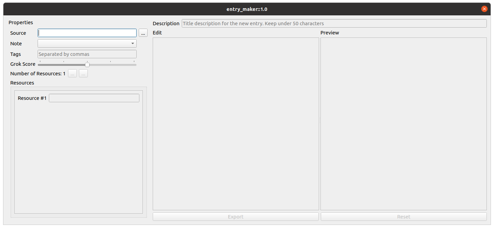

# Notes-EntryMaker

This has got to be one of the most niche applications I've created, but one 
that is very useful for me.

One of the things I do to keep track of my thoughts, but particularly the things
I learn on a daily basis is to keep track of them through notes I read with Obsidian. 

The structure of what I've done in the last year is to sort of mimic a database by 
having a central note that keeps track of every new thing I'm storing in some other
relevant note. I give it a title, a link to where I stored the information, and a couple of
extra metadata. 

In the notes containing the information there will usually be a link to where I got the 
knowledge from and the corresponding thoughts on what I learned.

The reasoning behind this is trying to capture most of what I get to learn everyday, and 
hoping to have some better recall for some of these things. There's been too many times
where I re-google things I've already done in the past, and sometimes those searches took 
a while to actually get to the useful knowledge. With this approach I know I'm able to start
somewhere as opposed to just blindly googling again.

## Requirements
- `python == 3.8`
- `pyqt5 == 5.15.4`

## Setup
```
# Install Dependencies
pip3 install requirements.txt
```

## Usage
`python3 ./src/entrymaker/app.py`

## Screenshots


## License
See the [LICENSE](https://github.com/joseyose/entrymaker/blob/main/LICENSE) file for license rights and limitations (MIT).
